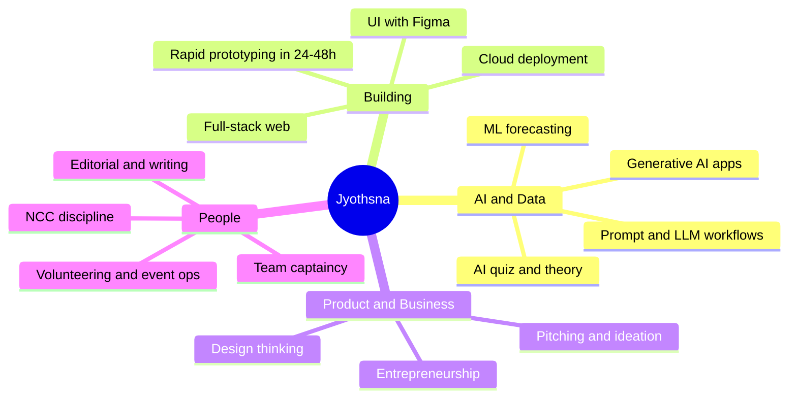
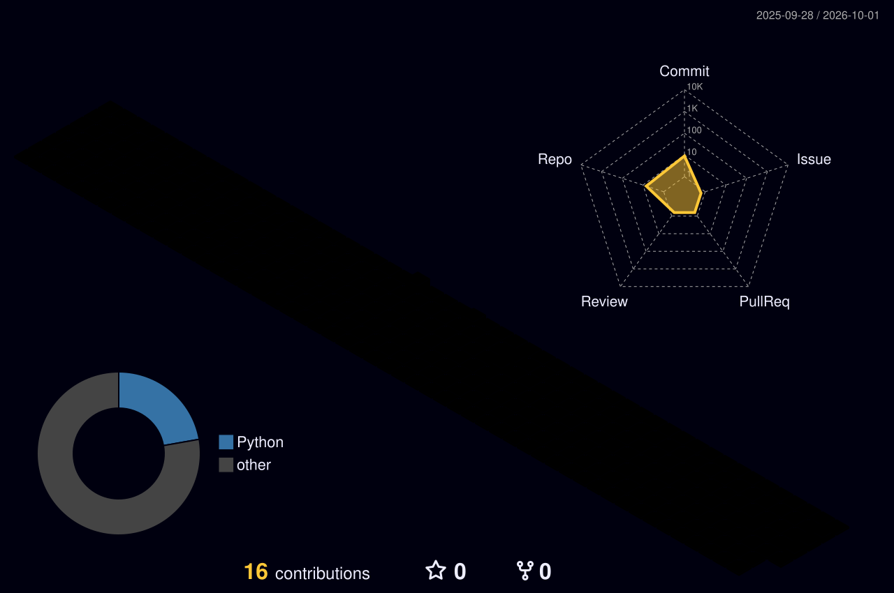

<div align="center">



<a href="https://github.com/jyo-lab"></a>

<br/>


</div>


## 👩‍🚀 Mission Briefing

```text
 ┌──────────────────────────────────────────────────────────────┐
 │  NAME       : Rayankula Jyothsna  (she/her)                  │
 │  BASE       : Bengaluru, India 🇮🇳                           │
 │  ACADEMY    : School of Engineering & Technology, CMR Univ. │
 │  ROLE       : Full-Stack Developer · AI/ML Enthusiast       │
 │  ALSO       : Sports Captain · Editorial Team               │
 │  STATUS     : 🟢 Building, learning, and entering hackathons│
 └──────────────────────────────────────────────────────────────┘
```

* 🔭 **Currently building:** [GreenPulse AI](https://github.com/jyo-lab/GreenPluse-AI) (campus energy and carbon intelligence) and [SafeStay / CrisisSync](https://github.com/jyo-lab/safestay) (AI emergency coordination for hotels)

* 🌱 **Currently learning:** agentic AI workflows, Google Cloud / AWS deployment, system design

* 💬 **Ask me about:** React, Python, Gen-AI apps, hackathon strategy, design thinking

* 🏆 **Recent:** IBM Bob 2.0 Hackathon (Sep 2026), Build Bengaluru Hackathon (Sep 2026), IdeateBLR '26 AI Ideathon (Sep 2026)

* 📫 **Reach me:** [LinkedIn](https://www.linkedin.com/in/rayankula-jyothsna-b8aa08300) · [Email](mailto:rayankula.jyothsna03@gmail.com) · [Portfolio](https://github.com/jyo-lab/jyo.pro)


## 🛰️ Tech Stack

<div align="center">

**Languages**


**Frontend and Backend**


**Databases**


**Cloud, DevOps and Tools**


</div>

<details>

<summary><b>🧬 Skills backed by my hackathons and projects</b></summary>

<br/>

| Domain                          | What I have actually done with it                                                                                    |
| ------------------------------- | -------------------------------------------------------------------------------------------------------------------- |
| **Generative AI / LLM apps**    | Built solutions with AI/ML, ChatGPT and IBM tooling (IBM Bob 2.0); Gemini on Google Cloud Run (SafeStay)             |
| **Machine Learning**            | Forecasting and anomaly detection for energy and water use (GreenPulse AI); National AI/ML Hackathon (IIT Hyderabad) |
| **Full-stack web**              | React, Node, Tailwind front ends, HTML portfolio (`jyo.pro`), real-time alerting UI                                  |
| **Cloud**                       | Google Cloud Run deployment, AWS-backed ideathon (IdeateBLR '26)                                                     |
| **Product and design thinking** | Spirit of Innovation Award, Design Thinking Day 2026; Figma for prototypes                                           |
| **Entrepreneurship**            | Two years in the IIT Bombay National Entrepreneurship Challenge (Advanced Track)                                     |

</details>


## 🚀 Featured Projects

<table>

<tr>

<td width="50%" valign="top">

### 🌿 [GreenPulse AI](https://github.com/jyo-lab/GreenPluse-AI)

Helps campuses cut energy and water waste by forecasting usage, spotting anomalies and tracking real-time carbon emissions. Its **Carbon Responsibility Score** drives accountability.


</td>

<td width="50%" valign="top">

### 🏨 [SafeStay / CrisisSync](https://github.com/jyo-lab/safestay)

Bridges guests, hotel staff and first responders during emergencies with AI-powered detection, real-time coordination and multilingual alerts. Powered by **Gemini on Google Cloud Run**.


</td>

</tr>

<tr>

<td width="50%" valign="top">

### 🌐 [jyo.pro](https://github.com/jyo-lab/jyo.pro)

My personal portfolio site.


</td>

<td width="50%" valign="top">

### 🧪 More in orbit

[`CODESOFT_5`](https://github.com/jyo-lab/CODESOFT_5) · [`ET-alpha`](https://github.com/jyo-lab/ET-alpha) · [`work`](https://github.com/jyo-lab/work)

<sub>Tip: add a one-line description to each repo so the pinned cards fill out.</sub>

</td>

</tr>

</table>


## 🏅 Achievements and Certificates

### 🤖 Hackathons and AI

| When            | Event                                                                                 | Result                                                                                                         |
| --------------- | ------------------------------------------------------------------------------------- | -------------------------------------------------------------------------------------------------------------- |
| Sep 25-27, 2026 | **IBM Bob 2.0 Hackathon** (lablab.ai × NativelyAI)                                    | ✅ Completion, "outstanding performance and attendance"; submitted a solution using AI/ML, ChatGPT and IBM tech |
| Sep 19, 2026    | **Build Bengaluru Hackathon** (HackBriven, Microsoft Office, Bangalore)               | 🎖️ Participant; sponsors Qwen, Enter Pro, Dodo Payments                                                       |
| Sep 3, 2026     | **IdeateBLR '26 AI Ideathon** (REVA University, Bengaluru Tech Week, with AWS)        | 🎖️ Participant                                                                                                |
| 2026            | **National AI/ML Hackathon** by Vivriti Capital of YUVAAN (IIT Hyderabad, via Unstop) | 🎖️ Participant                                                                                                |
| Jul 19, 2026    | **QuizOff 2026, India's Biggest AI Quiz** (CampusCrew × Unstop)                       | 🎖️ Among 5.25 lakh+ students from 48,500+ institutions                                                        |

### 💡 Innovation and Entrepreneurship

| When            | Event                                                                                  | Result                            |
| --------------- | -------------------------------------------------------------------------------------- | --------------------------------- |
| Apr 23-24, 2026 | **Design Thinking Day 'Cause 2026** (CMR University, Global Open Innovation Challenge) | 🥇 **Spirit of Innovation Award** |
| 2025            | **National Entrepreneurship Challenge 2025**, E-Cell IIT Bombay, Advanced Track        | 🏆 **Rank 147** nationwide        |
| 2024            | **National Entrepreneurship Challenge 2024**, E-Cell IIT Bombay, Advanced Track        | 🎖️ Certificate of Appreciation   |
| Sep 15, 2025    | **Engineer's Day Project Exhibition** (SoET, CMR University)                           | 🎖️ Participant                   |
| May 5, 2025     | **Internship Common Aptitude Test (ICAT)**                                             | 🎖️ Participant                   |

### 🏐 Leadership, Sports and Discipline

| When            | Event                                                      | Result                                           |
| --------------- | ---------------------------------------------------------- | ------------------------------------------------ |
| Apr 15-17, 2026 | **Sportspectra Inter-School Competition**, Kabaddi (Women) | 🥉 **3rd Runner-Up**                             |
| Aug 29-31, 2025 | **National Sports Day 2025**, Throwball (Women)            | 🥉 **3rd Runner-Up**, played as **Captain**      |
| Oct 10-19, 2025 | **NCC CATC B-18 Pre-IGC Camp**, 9 Karnataka Bn NCC         | 🎖️ Cadet, conduct rated on the camp certificate |
| Oct 18, 2025    | **EXPA CADET Training Program**, CATC Bangalore            | 🎖️ 8-hour training                              |

### 🤝 Community and Contribution

| When            | Role                                                                 | Where                                     |
| --------------- | -------------------------------------------------------------------- | ----------------------------------------- |
| Mar 25-26, 2026 | **Volunteer**, Prajnotsava 2026 (national-level technical symposium) | CSE (AI-ML), SoET, CMR University         |
| 2024-25         | **Editorial Team member**                                            | Office of Student Affairs, CMR University |


## 🧠 Skill Map (from certificates)



| Skill                                  | Proof                                                                         |
| -------------------------------------- | ----------------------------------------------------------------------------- |
| ⚡ **Rapid prototyping under pressure** | IBM Bob 2.0, Build Bengaluru, IdeateBLR '26, YUVAAN AI/ML                     |
| 🧭 **Leadership and teamwork**         | Throwball captain, Kabaddi 3rd Runner-Up, NCC cadet                           |
| 🎯 **Problem framing**                 | Spirit of Innovation Award, NEC Rank 147                                      |
| ✍️ **Communication and writing**       | Editorial team, event volunteering                                            |
| 🔁 **Consistency**                     | Two consecutive years in NEC Advanced Track, 16 certificates across 2024-2026 |


## 📊 GitHub Stats

<div align="center">


<br/>

<!-- If the two cards below ever show a broken image, the public host is rate-limited.
     Deploy your own copy of github-readme-stats on Vercel and swap the domain. -->


</div>

### 🌌 3D Contribution Calendar

<!-- Keep the path your existing 3D-contrib workflow already writes to. -->

<div align="center">



</div>

### 🐍 Contribution Snake

<!-- Keep the URL your existing snake workflow already produces. -->

<div align="center">

<picture>

<source media="(prefers-color-scheme: dark)" srcset="https://raw.githubusercontent.com/jyo-lab/jyo-lab/output/github-snake-dark.svg"/>


</picture>

</div>


<div align="center">


<br/><br/>

<a href="https://www.linkedin.com/in/rayankula-jyothsna-b8aa08300"></a>

<a href="mailto:rayankula.jyothsna03@gmail.com"></a>

<a href="https://github.com/jyo-lab/jyo.pro"></a>


</div>
